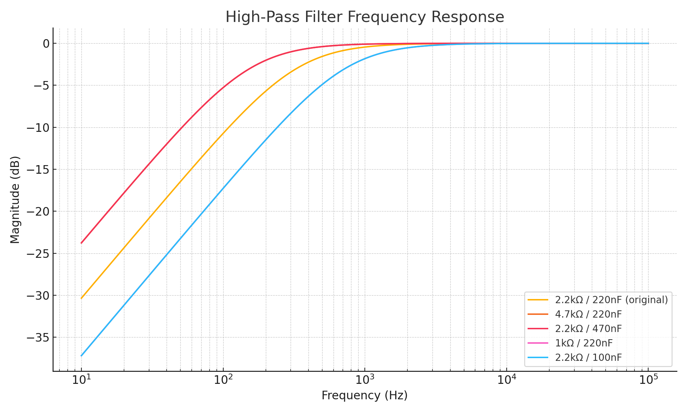

# 🎚️ White Noise Generator – Signal Path and Filter Analysis

This page explains how the White Noise Generator works, including gain stages and filter behavior. It also includes simulations showing how changing resistor or capacitor values will affect the output.

---

## 🔁 Signal Flow

### 1. Transistor Noise Source
- A **BC548** NPN transistor is reverse-biased between **base and emitter**.
- The **collector is not connected**.
- This produces a random broadband noise signal, AC-coupled by **C2 (10nF)** into the op-amp.

### 2. Gain Stage 1 – U1A
- Configuration: **Non-inverting amplifier**
- Components: R2 = 100kΩ, R3 = 100kΩ
- Gain:
  \[
  A_1 = 1 + \frac{R3}{R2} = 2
  \]

### 3. Gain Stage 2 – U2A
- Components: R4 = 100kΩ, R5 = 2.2kΩ
- Gain:
  \[
  A_2 = 1 + \frac{100k}{2.2k} \approx 46.5
  \]
- Feedback capacitor C3 = 220nF sets a **high-pass filter**:
  \[
  f_c = \frac{1}{2\pi R C} \approx \frac{1}{2\pi \cdot 2200 \cdot 220 \times 10^{-9}} \approx 330 \text{ Hz}
  \]

### 4. Output Stage – U2B
- Same gain as U2A
- Identical high-pass filtering from R7/C4 (220nF, 2.2kΩ)
- Feeds Eurorack-compatible audio jack

---

## 📊 Filter Response: What Changes with R and C?

This plot shows how adjusting the **R and C values** in the op-amp feedback path affects the output spectrum. Values are swept around the original 2.2kΩ / 220nF pair.

- Higher R or C → lower cutoff frequency → more bass
- Lower R or C → higher cutoff → more hiss/less rumble
- Default config (~330 Hz) filters out hum but preserves audio-range noise

---

## 💡 Exploration Ideas

- Try substituting **100nF** or **470nF** capacitors
- Use **1kΩ** or **4.7kΩ** feedback resistors
- Listen to the difference or measure output with a spectrum analyzer or Octave

---

## 🔗 Related Modules

- [Main White Noise Generator Page](./README.md)
- [Op-Amps (Concept)](https://github.com/elandahl/eurorack-course/blob/main/content/02-op-amps/README.md)
- [DC Equivalent Circuits](https://github.com/elandahl/eurorack-course/blob/main/content/01-dc-equivalent-circuits/README.md)

