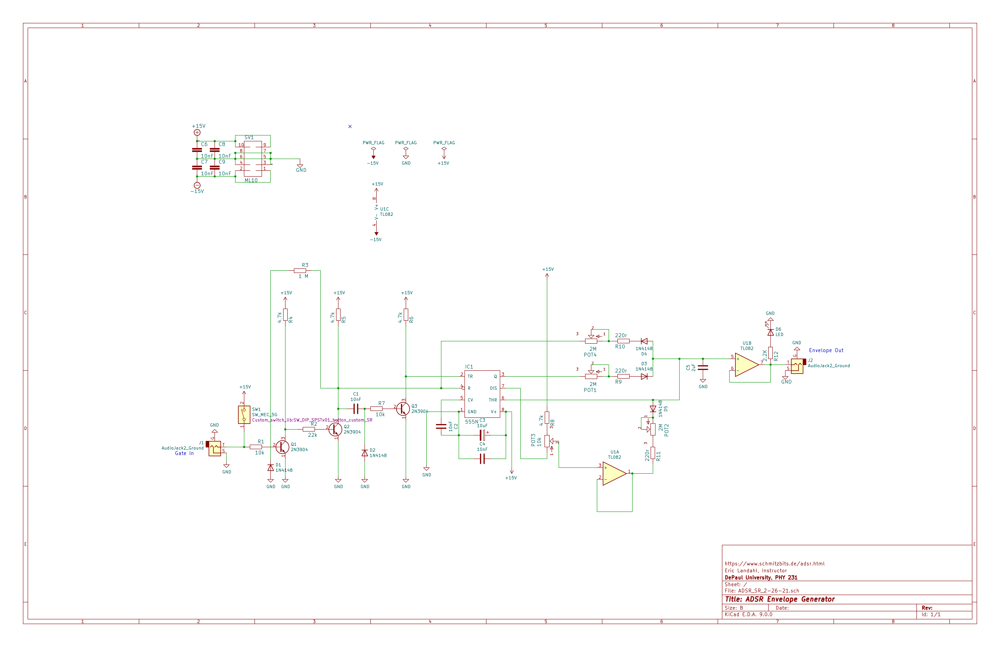

# 🎚️ ADSR Envelope Generator

**Project 04 – Modular Synthesizer Course**

This Eurorack-compatible module implements an **ADSR (Attack, Decay, Sustain, Release)** envelope generator using a **TLC555 CMOS timer**, op-amps, discrete transistors, and a shaping network of resistors, capacitors, and diodes. When triggered by a gate signal, it produces a control voltage that follows a classic ADSR shape used to control VCAs, filters, or pitch over time in a modular synthesizer.

The design is adapted from [René Schmitz’s "Fastest Envelope in the West"](https://www.schmitzbits.de/adsr.html), simplified for modern components and student assembly.

---

## 🔁 How It Works

The four phases:

- **Attack** – how quickly the voltage rises to its peak when a gate is received  
- **Decay** – how quickly it falls to the sustain level after the attack  
- **Sustain** – the level held while the gate is high  
- **Release** – how quickly the envelope falls to zero after the gate ends  

A CMOS 555 timer (TLC555) generates a fixed-duration logic pulse that controls a capacitor (C3) charged and discharged through different RC paths. Diodes steer current direction for each phase, and an op-amp buffers the output.

---

## 🧰 Schematic Overview

Below is the schematic for the ADSR Envelope Generator (`ADSR_SR_2-26-21`):

---

## 📁 Circuit and Design Files

This folder includes the full set of KiCad source files:

- `ADSR_SR_2-26-21.sch` – Schematic (KiCad)
- `ADSR_SR_2-26-21.kicad_pcb` – PCB layout (KiCad)
- `ADSR_SR_2-26-21.csv` – Bill of Materials (BOM)
- `ADSR_SR_2-26-21-backups/` – Backup and autosave files
- `.lib`, `.dcm`, `.pro`, `.net`, `.xml` – Supporting KiCad project data

---

## 🧾 Bill of Materials (BOM)

| Qty | Component            | Value        | Notes                          |
|-----|----------------------|--------------|---------------------------------|
| 1   | Timer IC             | TLC555       | CMOS version (not NE555)        |
| 1   | Op-Amp               | TL072        | Dual op-amp, buffer and divider |
| 3   | NPN Transistor       | 2N3904       | Gate pulse shaping              |
| 3   | Potentiometer        | 1 MΩ Linear  | Attack, Decay, Release          |
| 1   | Potentiometer        | 10k Linear   | Sustain                      $
| 1   | Capacitor (polarized)| 10 µF        | TLC555 timing cap               |
| 1   | Capacitor (bipolar)  | 2.2 µF       | Envelope integrator             |
| 7   | Capacitor (ceramic)  | 10 nF        | Supply and signal decoupling         |
| 3   | Resistor             | 220 Ω        | Series with A/D/R pots          |
| 2   | Resistor             | 10 kΩ        | Input and transistor base         |
| 4   | Resistors            | 4.7 kΩ       | Transistor bias, 555 pull-up    |
| 1   | Resistor             | 22 kΩ        | Transistor base drive          
| 1   | Resistor             | 1 MΩ         | 555 reset                      
| 1   | Resistor             | 2.2 kΩ       | LED current limit                      
| 5   | Diodes               | 1N4148       | Signal steering (A/D/R + reset) |
| 1   | Red LED              | Oval         | Output indicator               
| 1   | Pushbutton Switch    | N.O.         | Manual trigger                 
| 1   | IDC Header           | 10-pin (ML10)| Eurorack power                  |

---

## 🛠️ Assembly Guide (with Photos)

Step-by-step build documentation is available here:

📷 [Google Drive – ADSR Assembly Photos](https://drive.google.com/drive/folders/1wlfnccw4EV9Ylf7Mrc6TivC7RlBOovWM?usp=sharing)

This includes high-res annotated photos, component placement, and tips for first-time solderers.

---

## 📊 Analysis & Simulation

An in-depth analysis of the ADSR envelope shaping and RC time constants is provided here:

🔍 [ADSR Technical Analysis](./analysis.md)

Simulation tools using [LushProjects](https://lushprojects.org/circuitjs/) can help visualize:

- [Gate trigger + transistor shaper](https://tinyurl.com/y66v7bsb)  
- [Full ADSR timing circuit](https://tinyurl.com/y358uu4k)

---

## 🕰️ Legacy Files

The folder includes earlier schematic files and alternate circuit variants:

- `ADSR.sch`, `ADSR.pro`, etc. — original Eagle-imported designs
- `sequencer.*` files — not used in this project
- `.bak`, `.xml`, `.net` — backup and compiler artifacts

These are included for historical completeness and archival.

---

